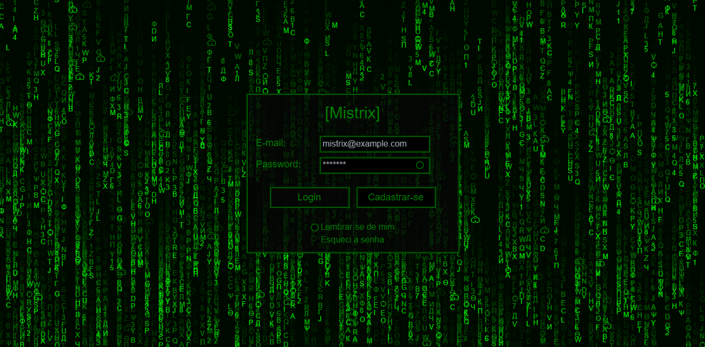
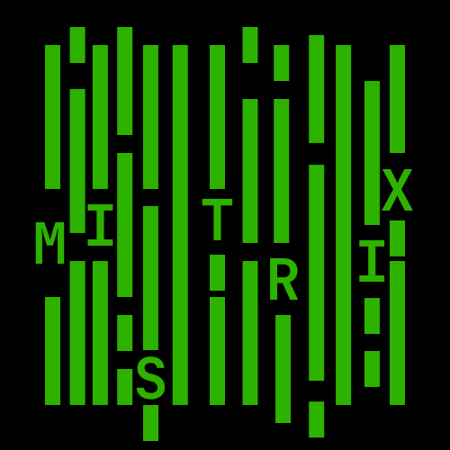

# [Mistrix]

<div style="display: inline_block">



## Índice

- [Título e Imagem de capa](#mistrix-project)
- [Descrição do projeto](#-descrição-do-projeto)
- [Tecnologias Utilizadas](#-tecnologias-utilizadas)
- [Executando](#-executando)
- [Deploy](#-deploy)
- [Desenvolvido](#-desenvolvido-por)
- [Licença](#%EF%B8%8F-licença)

</div>

## 📄 Descrição do Projeto

O <strong>[Mistrix]</strong> é um pequeno sistema desenvolvido com React, TypeScript, TailwindCSS, Firebase e LocalStorage, o qual foi desenvolvido para a disciplina de LOP ministrada pelo prof. Aquiles Burlamaqui.
- Tecnologias Utilizadas;
- Estrutura de Arquivos;
- Componentes React;
- Estilos com TailwindCSS;
- Integração com Firebase;
- Armazenamento Local com LocalStorage;
- Outras Funcionalidades.

## 🛠 Tecnologias Utilizadas

<div align="center">
    
    
    
    
    
    
    <!--  -->
    
    
</div>

## 👩‍💻 Executando 

Após clonar o repositório, acesse a pasta do projeto e execute os comandos abaixo:

```sh
npm install 
npm run dev
```

Acesse http://localhost:5173 para visualizar a aplicação.

## 🚀 Deploy

Utilizei no deploy a [Vercel](https://vercel.com/) que é uma plataforma voltada para a hospedagem de aplicações de uma forma bem simples e rápida. <a href= "#" target="_blank"> Clique Aqui </a> para visualizar o projeto.

## 🚧 Desenvolvido Por 
`Misla Wislaine` para a disciplina de LOP ministrada pelo prof. Aquiles Burlamaqui.

## 🗂️ Licença

Este projeto está sob a licença [MIT](LICENSE).